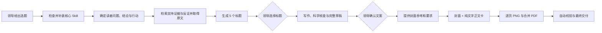

# 小红书科学新媒体数字员工

这是一个可恢复、可迁移、面向普通读者的小红书科普生产技能包。它把写作目标从“防止任何误解”改为“让普通人一次听懂”：先明确读者最关心的问题、可执行结论和行动建议，再用支持证据与反证校准事实边界，继续完成文章写作、封面、纯文字正文卡、逐页 PNG、合并 PDF 和评论区钩子。

证据决定事实能说到哪里，但不替文章决定结构。不同大模型可以保留自己的推理与表达风格，同时遵守同一套受众顺序、审批节点、状态机和交付标准。

## 工作流程



正常情况下有三个计划内确认点：从 5 个标题中选择 1 个、确认完整文案、提供或确认封面方向。只有当 XML 和 PDF 原文都无法合法取得时，数字员工才会额外请求人工上传论文。

## 四个核心 Skill

启动前必须检查以下能力。缺失时，从技能包内置副本自动补装，不覆盖已有安装。

| Skill | 作用 |
|---|---|
| `dbs-content` | 诊断受众问题、内容立场、信息密度和内容骨架 |
| `dbs-xhs-title` | 按可追溯公式生成 5 个小红书标题 |
| `dbs-resonate` | 找出唯一核心机制并完成传播共鸣诊断 |
| `humanizer-zh` | 去除 AI 写作痕迹，同时保留事实与风险边界 |

PDF 处理、图片生成、网页制作和浏览器检查属于可替代能力：存在对应 Skill 时调用；不存在时，由当前模型使用本地工具完成等价工作。

## 文献策略

先从普通读者真正关心的问题出发，形成一个清楚、可执行的暂定结论，再围绕这个结论检索支持证据和可能推翻它的反证。锚点论文必须真正支撑文章使用的核心结果；证据用来确定事实边界和措辞强度，不要求文章沿着论文结构复述。

原文获取顺序固定为：

1. 优先获取结构化 XML 原文。
2. XML 不可得时获取 PDF 原文。
3. XML 与 PDF 均不可得时，给出准确题名、期刊、年份和 DOI，请人工上传论文。

摘要只能用于判断论文是否值得采用，不能代替最终生产所需的原文。面向普通读者时优先给出明确结论和行动，但不得把动物实验、机制研究或相关性证据直接写成人体确定疗效。

## 状态机

每个项目使用 `work/status.json` 保存进度。更换模型、任务中断或等待领导选择后，都可以从当前阶段继续，不必重复已经完成的研究。

主要状态包括：

```text
bootstrapping
  -> researching
  -> acquiring_source
  -> preparing_titles
  -> waiting_for_title
  -> producing
  -> rendering
  -> validating
  -> complete
```

论文缺失时进入 `waiting_for_source_upload`；发生不可恢复的运行错误时进入 `blocked`。

## 最终交付

一次完整运行会交付：

- 选定标题和完整小红书文章；
- 第一页遵循用户给出的参考图和封面要求；没有明确方向时，默认采用上方 55% 主题图、下方 45% 深色大标题区；
- 中间正文页默认每页 120–150 个中文字，只讲一个结论，不使用复杂插图、图表或装饰性排版；
- HTML/CSS 静态截图网页；
- 每个 `section.page` 对应一张 `1200×1600` PNG；
- 与 PNG 顺序一致的合并 PDF；
- 最后一页简单收束，只保留中文标题和论文首页或 XML 文章头部截图；
- 单独保存的评论区钩子。

图文网页不使用 JavaScript，不包含交互。评论区钩子不进入图文卡片。整套卡片通常为 7–10 页，并严格区分生成式封面、纯文字正文卡和论文依据末页三种页面角色。

## 使用方式

向数字员工直接提供选题，例如：

```text
做一个小红书选题：姨妈前做什么不长痘
```

研究完成后，它只会先返回：

```text
1. 标题
2. 标题
3. 标题
4. 标题
5. 标题

回复数字 1-5，或直接发你想用的标题。
```

选择标题后，数字员工会先提交完整卡片文案；文案确认后，再收集封面参考和明确要求，随后自动完成排版、导出和校验。

## 安装

仓库根目录是一个 Codex 插件包，入口位于：

```text
.codex-plugin/plugin.json
skills/xhs-science-media/SKILL.md
```

也可以把 `skills/xhs-science-media/` 整体复制到目标 Agent 的技能目录：

| Agent | 常用目录 |
|---|---|
| Codex | `~/.codex/skills/xhs-science-media/` |
| Claude Code | `~/.claude/skills/xhs-science-media/` |
| 通用 Agents | `~/.agents/skills/xhs-science-media/` |
| Grok | `~/.grok/skills/xhs-science-media/` |

不要只复制 `SKILL.md`。自动补装脚本、状态机、卡片模板和四个核心 Skill 都在同一目录内。

## 导出与校验

统一导出入口：

```text
scripts/export_cards.py <project-folder>
```

脚本会在 Windows、macOS 或 Linux 上查找可用的 Chromium 浏览器和 Poppler。若当前系统工具不同，工作流会在项目内生成并验证当前系统专用导出脚本。

自动校验入口：

```text
scripts/validate_deliverables.py <project-folder>
```

它强制检查 7–10 张卡片、每张 `1200×1600`、PDF 页数一致、JavaScript 禁用、评论区钩子独立保存，以及三种页面角色：第一页生成式图文封面、中间纯文字正文卡、最后一页中文标题加论文首页截图。视觉溢出、论文可读性和证据边界仍需在交付前检查。

## 目录结构

```text
xhs-science-media-employee/
├── .codex-plugin/plugin.json
├── README.md
└── skills/xhs-science-media/
    ├── SKILL.md
    ├── agents/
    ├── assets/
    │   ├── card-template/
    │   └── core-skills/
    ├── references/
    └── scripts/
```

## 发布说明

仓库内嵌的核心 Skill 保留其原始说明与已有许可文件。本仓库目前没有额外声明统一的开源许可证；公开分发或商用前，应分别确认这些组件的授权范围。
